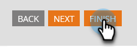

# Alterar o idioma de um formulário {#change-the-language-of-a-form}

Saiba como alterar o idioma do formulário.

1. Vá para **Atividades de marketing**.

   

1. Selecione seu formulário e clique em **Editar Formulário**.

   

1. Clique em **Configurações de Formulário** e selecione **Configurações**.

   

1. Selecione o **Idioma do Formulário** desejado.

   

   ETAPA OPCIONAL: escolha a localidade/região do idioma selecionado.

   

1. Clique em **Concluir**.

   

1. Clique em **Aprovar e Fechar** para aplicar e salvar as alterações.

   

   >[!NOTE]
   >
   >O formulário deve ser aprovado para ser usado em landing pages.

   >[!TIP]
   >
   >Lembre-se de [aprovar o rascunho da página de aterrissagem](/help/marketo/product-docs/demand-generation/landing-pages/understanding-landing-pages/approve-unapprove-or-delete-a-landing-page.md) criado pelas alterações de formulário.

O formulário refletirá o idioma selecionado.

