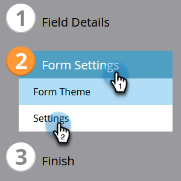
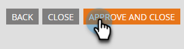

# Alterar o idioma de um formulário {#change-the-language-of-a-form}

Saiba como alterar o idioma do formulário.

>[!IMPORTANT]
>
>Seguir as etapas deste artigo alterará o idioma dos campos padrão do Marketo, bem como a redação usada no rótulo do botão Enviar. Ele não traduzirá [campos personalizados](/help/marketo/product-docs/administration/field-management/create-a-custom-field-in-marketo.md){target="_blank"}.

1. Vá para **Atividades de marketing**.

   

1. Selecione seu formulário e clique em **Editar Formulário**.

   

1. Clique em **Configurações de Formulário** e selecione **Configurações**.

   

1. Selecione o **Idioma do Formulário** desejado.

   

   ETAPA OPCIONAL: escolha a localidade/região do idioma selecionado.

   

1. Clique em **Concluir**.

   

1. Clique em **Aprovar e Fechar** para aplicar e salvar as alterações.

   

   >[!NOTE]
   >
   >O formulário deve ser aprovado para ser usado nas páginas de destino.

   >[!TIP]
   >
   >Lembre-se de [aprovar o rascunho da Página de Aterrissagem](/help/marketo/product-docs/demand-generation/landing-pages/understanding-landing-pages/approve-unapprove-or-delete-a-landing-page.md) criado pelas alterações de formulário.

O formulário refletirá o idioma selecionado.

