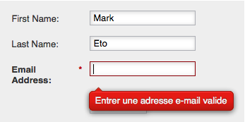

# Altere o idioma das mensagens de erro/validação de formulário e o botão Enviar {#change-the-language-of-form-validation-error-messages-and-submit-button}

Você sabia que pode personalizar o formulário para fornecer mensagens em outro idioma? Veja isto.

>[!NOTE]
>
>Isso também altera o idioma do botão Enviar.

1. Vá para **Marketing** **Atividade**.

   

1. Selecione seu formulário e clique em **Editar formulário.**

   

1. Em **Configurações do formulário,** clique em **Configurações**.

   

1. Selecione o **Erro** **Idioma** de que necessita.

   

1. Clique em **Concluir**.

   

1. Clique em **Aprovar e Fechar** para aplicar e salvar as alterações.

   >[!NOTE]
   >
   >O formulário deve ser aprovado para uso no landing page.

   

   >[!NOTE]
   >
   >**Lembrete**
   >
   >
   >Lembre-se de [aprovar o rascunho da landing page](../../../../product-docs/demand-generation/landing-pages/understanding-landing-pages/approve-unapprove-or-delete-a-landing-page.md) criado pelas alterações de formulário.

   

E voila! A validação do formulário e as mensagens de erro serão exibidas no idioma desejado.