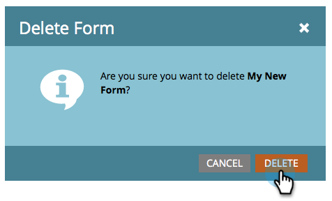

# Excluir um formulário {#delete-a-form}

Se você tiver um formulário de que não precisa e que não está sendo usado, é possível excluí-lo. Veja como.

1. Acesse **[!UICONTROL Atividades de marketing]**.

   

1. Localize e selecione seu formulário.

   

1. Em **[!UICONTROL Ações de formulário]**, clique em **[!UICONTROL Excluir formulário]**.

   

   >[!NOTE]
   >
   >Lembre-se de remover o formulário de qualquer/todas as páginas de aterrissagem que o utilizam. Além disso, confirme se o formulário não está sendo usado em um site público.

1. Confirme clicando em **[!UICONTROL Excluir]**.

   

1. Se o formulário estiver sendo usado em uma página de aterrissagem do Marketo, você não poderá excluí-lo. Você precisa removê-lo das landing pages em que ele estiver.

   

>[!CAUTION]
>
>Se você excluir um formulário que está sendo usado pelo seu site público, não verá um aviso e o formulário será corrompido. Considere [arquivá-lo](/help/marketo/product-docs/email-marketing/drip-nurturing/using-stream-content/archive-and-unarchive-stream-content.md).
