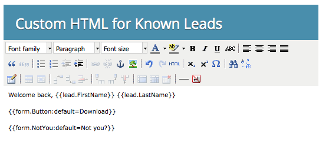

# Mostrar formulário HTML personalizado para pessoas conhecidas {#show-custom-html-form-for-known-people}

Se um visitante tiver fornecido seu nome completo e endereço de email no passado e você não quiser que ele receba o formulário inteiro, saiba como mostrar a ele algum HTML personalizado (por exemplo, apenas um botão de download).

1. Vá para **[!UICONTROL Atividades de marketing]**.

   

1. Em **[!UICONTROL Atividades de marketing]**, selecione seu formulário e clique em **[!UICONTROL Editar formulário]**.

   

1. Em **[!UICONTROL Configurações de Formulário]**, clique em **[!UICONTROL Configurações]**.

   

1. Defina Se **[!UICONTROL Visitante conhecido, Mostrar]**: como **[!UICONTROL HTML personalizado]**.

   

1. Clique no  para editar o **[!UICONTROL HTML Personalizado]** que será exibido para pessoas conhecidas.

   

1. Há conteúdo padrão, mas fique à vontade para alterá-lo.

   

   Tokens disponíveis:

   | Token | Descrição |
   |---|---|
   | `{{lead.FirstName}}` | Isso exibirá o nome da pessoa. |
   | `{{lead.LastName}}` | Isso exibirá o sobrenome da pessoa. |
   | `{{form.Button:default=Download}}` | Isso exibirá o botão de formulário. Substitua a área após `=` para alterar o texto do botão. |
   | `{{form.NotYou:default=Not you?}}` | Isso exibirá um link caso a pessoa seja outra pessoa. Substitua a área após `=` para alterar o texto do link. |

   >[!CAUTION]
   >
   >Somente os quatro tokens acima podem ser usados. Nenhum outro token funcionará aqui.

1. Clique em **[!UICONTROL Concluir]**.

   

1. Clique em **[!UICONTROL Aprovar e Fechar]**.

   >[!NOTE]
   >
   >O formulário deve ser aprovado para ser usado em landing pages.

   

   >[!NOTE]
   >
   >Lembre-se de [aprovar o rascunho da página de aterrissagem](/help/marketo/product-docs/demand-generation/landing-pages/understanding-landing-pages/approve-unapprove-or-delete-a-landing-page.md) criado pelas alterações de formulário.

   Pedaço de bolo! Confira o que uma pessoa veria se voltasse ao mesmo formulário:

   

   >[!TIP]
   >
   >Você pode direcionar o clique do botão para o ativo definindo a página de acompanhamento do formulário para o URL do arquivo.
