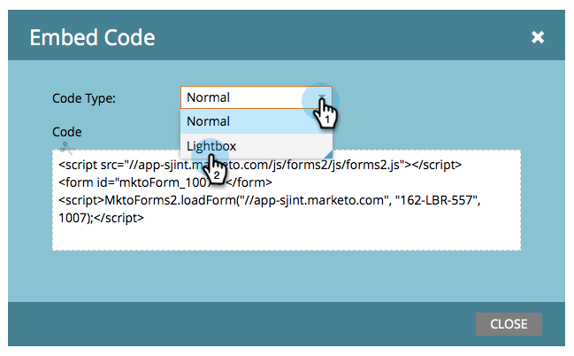

# Usar um formulário em um Lightbox {#use-a-form-in-a-lightbox}

Uma Lightbox é uma técnica que abre um formulário na frente do conteúdo quando você deseja que ele seja exibido. Veja como.

1. Vá para **Atividades de marketing**.

   

1. Localize e selecione seu formulário.

   

1. Em **Ações de Formulário**, clique em **Incorporar Código**.

   >[!NOTE]
   >
   >O formulário deve ser aprovado para que o item de código incorporado fique visível/utilizável.

   

1. Definir **Tipo de Código** como **Lightbox**.

   

1. Selecione/copie o código e clique em **Fechar**.

   

Entregue o código ao desenvolvedor da Web e solicite que ele o adicione ao seu site.

Ótimo trabalho!
