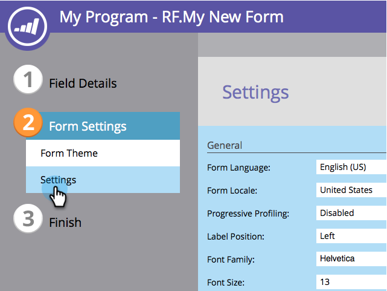

# Alterar a posição do rótulo do formulário {#change-form-label-position}

Ao [criar um formulário](/help/marketo/product-docs/demand-generation/forms/creating-a-form/create-a-form.md), é possível alterar o posicionamento dos rótulos de campo de formulário com muita facilidade. Veja como.

1. Acesse **[!UICONTROL Atividades de marketing]**.

   

1. Selecione seu formulário e clique em **[!UICONTROL Editar Formulário]**.

   

1. Selecione **[!UICONTROL Configurações]**.

   

1. Selecione a **[!UICONTROL Posição do Rótulo]** desejada.

   

   No momento, você tem duas opções:

   * [!UICONTROL Esquerda] (padrão)
   * [!UICONTROL Acima]

1. Clique em **[!UICONTROL Concluir]**.

   

1. Clique em **[!UICONTROL Aprovar e Fechar]**.

   >[!NOTE]
   >
   >O formulário deve ser aprovado para ser usado em landing pages.

   

   >[!NOTE]
   >
   >Lembre-se de aprovar o rascunho da página de aterrissagem criado pelas alterações do formulário.

>[!MORELIKETHIS]
>
>[Alterar a Família de Fontes de Formulário](/help/marketo/product-docs/demand-generation/forms/form-design/change-the-form-font-family.md)
