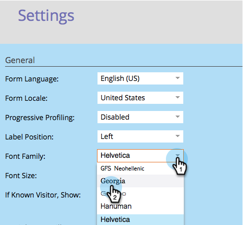

# Alterar a família de fontes de formulário {#change-the-form-font-family}

O Google Fonts é fantástico, e nós os inserimos diretamente no editor de formulários. Confira!

>[!NOTE]
>
>Essa configuração afeta o rótulo do formulário, o texto de entrada e qualquer rich text.

1. Vá para **Marketing** **Atividade**.

   

1. Selecione o formulário e clique em **Editar** **Formulário**.

   

1. Em **Formulário** **Definições**, selecione **Definições**.

   

1. Selecione a **Família de Fontes** desejada.

   >[!TIP]
   >
   >Um monte de [Fontes do Google](http://www.google.com/fonts) estão disponíveis para uso.

   

1. Clique em **Concluir**.

   

1. Clique em **Aprovar e Fechar**.

   >[!NOTE]
   >
   >O formulário deve ser aprovado para uso no landing page.

   

   >[!NOTE]
   >
   >**Lembrete**
   >
   >
   >Lembre-se de aprovar o rascunho de landing page criado pelas alterações de formulário.

   

Veja como foi fácil alterar a família de fontes em um formulário? Legal, agora que está pronto, vamos aprender a mudar o tamanho da fonte do formulário.

>[!MORELIKETHIS]
>
>* [Alterar o tamanho da fonte do formulário](change-the-form-font-size.md)

>

