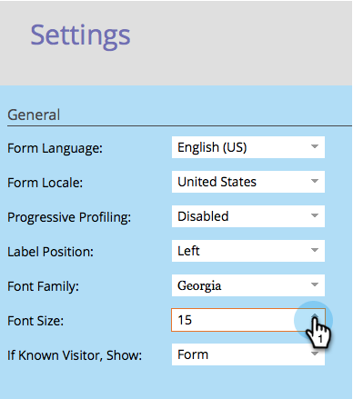

# Alterar o tamanho da fonte do formulário {#change-the-form-font-size}

O Marketo facilita a personalização da aparência de seus formulários. Uma coisa que você pode querer fazer é alterar o tamanho da fonte. Veja como.

>[!TIP]
>
>Essa configuração afeta o rótulo do formulário, o texto de entrada e o texto do botão Enviar.

1. Vá para **Atividades de marketing**.

   

1. Selecione o formulário e clique em **Editar formulário**.

   

1. Em **Configurações do formulário**, selecione **Configurações**.

   

1. Selecione o **Tamanho da fonte** desejado.

   

1. Clique em **Concluir**.

   

1. Clique em **Aprovar e Fechar**.

   >[!NOTE]
   >
   >O formulário deve ser aprovado para uso no landing page.

   

   >[!NOTE]
   >
   >Lembre-se de aprovar o rascunho de landing page criado pelas alterações de formulário.

   

Pedaço de bolo! Você entendeu.
