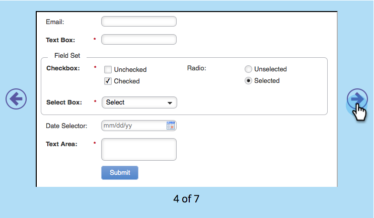

# Editar o CSS de um Tema de Formulário {#edit-the-css-of-a-form-theme}

Você tem alguns pré-criados [temas que você pode escolher](/help/marketo/product-docs/demand-generation/forms/creating-a-form/select-a-form-theme.md). Mas se você ama editar o CSS, pode fazer as alterações desejadas. Veja como.

>[!NOTE]
>
>Verifique se você sabe o CSS se deseja tentar isso, pois o Suporte da Marketo não está configurado para auxiliar no código personalizado. Além disso, todas as alterações feitas serão aplicadas somente ao formulário que você está editando no momento.

1. Ir para **Atividades de marketing**.

   

1. Selecione o formulário e clique em **Editar formulário**.

   

1. Ir para **Configurações do formulário**.

   

1. Selecione o tema para o qual deseja fazer alterações.

   

1. No ícone de engrenagem, clique em **Exibir CSS do Tema**.

   

1. Você pode cortar/colar esse CSS em seu próprio editor. É somente leitura, portanto, você só precisará do CSS de substituição.

   

1. Clique em **Fechar**.

   

1. No ícone de engrenagem, clique em **Editar CSS Personalizado**.

   

1. Insira seu CSS personalizado. Você não precisa de tudo, apenas as partes que são diferentes.

   

1. Quando terminar, clique em **Salvar**.

   

1. Para ver seu formulário personalizado, clique em **Visualizar rascunho**.

   

E é isso!
