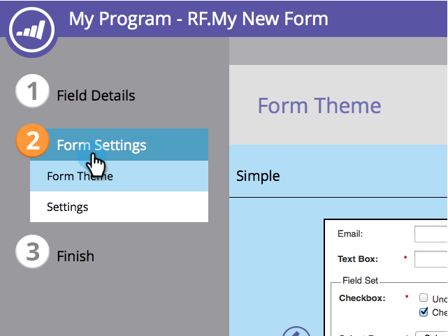

# Editar o CSS de um tema de formulário {#edit-the-css-of-a-form-theme}

Você tem alguns [temas pré-construídos que você pode simplesmente escolher entre](/help/marketo/product-docs/demand-generation/forms/creating-a-form/select-a-form-theme.md). Mas se você adora editar o CSS, é possível fazer as alterações desejadas. Veja como.

>[!NOTE]
>
>Certifique-se de saber o CSS se quiser tentar isso, pois o Suporte do Marketo não está configurado para auxiliar na codificação personalizada. Além disso, as alterações feitas serão aplicadas somente ao formulário que você está editando atualmente.

1. Vá para **[!UICONTROL Atividades de marketing]**.

   

1. Selecione seu formulário e clique em **[!UICONTROL Editar Formulário]**.

   

1. Vá para **[!UICONTROL Configurações de Formulário]**.

   

1. Selecione o tema para o qual deseja fazer alterações.

   

1. No ícone de engrenagem, clique em **[!UICONTROL Exibir tema CSS]**.

   

1. Você pode recortar/colar esse CSS em seu próprio editor. Ele é somente leitura, portanto, você só precisará da substituição do CSS.

   

1. Clique em **[!UICONTROL Fechar]**.

   

1. No ícone de engrenagem, clique em **[!UICONTROL Editar CSS personalizado]**.

   

1. Insira seu CSS personalizado. Você não precisa de tudo isso, apenas as partes que são diferentes.

   

1. Quando terminar, clique em **[!UICONTROL Salvar]**.

   

1. Para ver seu formulário personalizado, clique em **[!UICONTROL Visualizar Rascunho]**.

   

E é isso!
