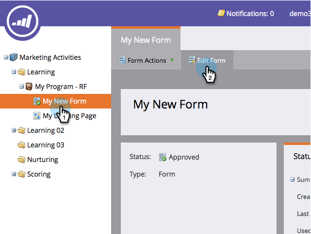
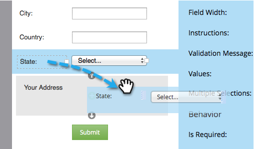

# Adicionar um conjunto de campos a um formulário {#add-a-fieldset-to-a-form}

Os conjuntos de campos são legais. Eles agrupam vários campos. Você também pode controlar um bloco inteiro de uma só vez!

1. Vá para **[!UICONTROL Atividades de marketing]**.

   

1. Selecione seu formulário e clique em **[!UICONTROL Editar Formulário]**.

   

1. Clique no sinal **+** e selecione **[!UICONTROL Fieldset]**.

   

1. Selecione o **fieldset** e insira um **[!UICONTROL Rótulo]**.

   

1. Arraste os campos desejados para o **fieldset**.

   

1. Veja como deveria parecer quando concluído.

   

É isso aí!

>[!TIP]
>
>Dependendo de outro campo, é possível ocultar/mostrar dinamicamente todo o conjunto de campos. Saiba mais sobre [regras de visibilidade](/help/marketo/product-docs/demand-generation/forms/form-fields/dynamically-toggle-visibility-of-a-form-field.md).
