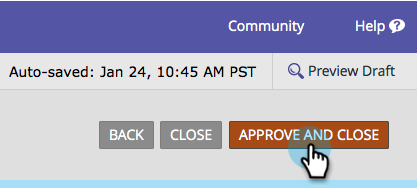
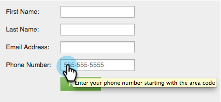

# Adicionar instruções de dica de ferramenta a um campo de formulário {#add-tooltip-instructions-to-a-form-field}

[Dicas](/help/marketo/product-docs/demand-generation/forms/form-fields/add-hint-text-to-a-form-field.md) e instruções ajudam as pessoas a preencher formulários. Veja como adicionar instruções de dica de ferramenta.

>[!NOTE]
>
>**Definição**
>
>O formulário **Dicas** é o texto contido no campo que desaparece quando o visitante começa a digitar no campo.
>
>Formulário **Instruções** são pequenas dicas de ferramenta que aparecem quando o visitante passa o mouse sobre o campo.

1. Vá para **[!UICONTROL Atividades de marketing]**.

   

1. Selecione seu **formulário** e clique em **[!UICONTROL Editar Formulário]**.

   

1. Selecione seu campo e insira **[!UICONTROL Instruções]**.

   

1. Clique em **[!UICONTROL Concluir]**.

   

1. Clique em **[!UICONTROL Aprovar e Fechar]**.

   

   >[!NOTE]
   >
   >Não esqueça de [aprovar o rascunho da página de aterrissagem](/help/marketo/product-docs/demand-generation/landing-pages/understanding-landing-pages/approve-unapprove-or-delete-a-landing-page.md) criado pelas alterações de formulário.

   

Ótimo trabalho! A dica de ferramenta será exibida quando um visitante passar o mouse sobre o campo.
