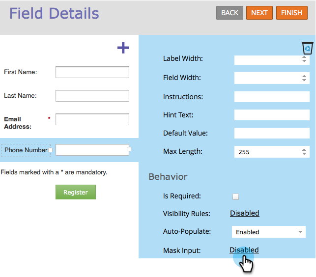

# Aplicar mascaramento de entrada a um campo em um formulário {#apply-input-masking-to-a-field-in-a-form}

É possível restringir a entrada do visitante usando uma máscara de entrada. Por exemplo, talvez você queira que os visitantes insiram números de telefone somente em um formato específico.

1. Acesse **[!UICONTROL Atividades de marketing]**.

   

1. Selecione seu formulário e clique em **[!UICONTROL Editar Formulário]**.

   

1. Selecione seu campo e verifique se o **[!UICONTROL Tipo de Campo]*** está definido como **[!UICONTROL Texto]**.

   >[!NOTE]
   >
   >O mascaramento de entrada só funciona com **[!UICONTROL Tipos de Campos de Texto]**.

   

1. Clique no link **[!UICONTROL Entrada de máscara]**.

   

1. Insira sua máscara de entrada e clique em **[!UICONTROL Salvar]**.

   

   >[!NOTE]
   >
   >Preste atenção às regras de mascaramento. Você pode restringir a entrada a números, letras e/ou até mesmo limitar o número de caracteres inseridos.

1. Clique em **[!UICONTROL Concluir]**.

   

1. Clique em **[!UICONTROL Aprovar e Fechar]**.

   

   Agora você solicita ao visitante que insira números em um formato específico.

   

   >[!NOTE]
   >
   >O campo pode não exibir regiões predefinidas, conforme mostrado na imagem acima. Pode parecer em branco até que o visitante comece a inserir números, que seguirão automaticamente ao formato de entrada definido para o campo.
