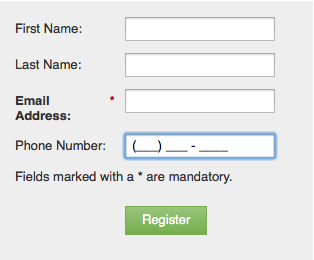

# Aplicar máscara de entrada a um campo em um formulário {#apply-input-masking-to-a-field-in-a-form}

Você pode restringir a entrada do seu visitante usando uma máscara de entrada. Por exemplo, você pode querer que os visitantes digitem somente números de telefone em um formato específico.

1. Ir para **Atividades de marketing**.

   

1. Selecione o formulário e clique em **Editar formulário**.

   

1. Selecione o campo e verifique se a variável **Tipo de campo** está definida como **Texto**.

   >[!NOTE]
   >
   >O mascaramento de entrada funciona somente com **Tipos de campo de texto**.

   

1. Clique no botão **Entrada de máscara** link .

   

1. Insira sua máscara de entrada e clique em **Salvar**.

   

   >[!NOTE]
   >
   >Preste atenção às regras de mascaramento. É possível restringir a entrada a números, letras e/ou até mesmo limitar o número de caracteres inseridos.

1. Clique em **Concluir**.

   

1. Clique em **Aprovar e fechar**.

   

   Dê uma olhada! Agora você está pedindo ao visitante para inserir números em um formato específico.

   

   >[!NOTE]
   >
   >O campo pode não exibir regiões predefinidas, como mostrado na imagem acima. Ele pode aparecer em branco até que o visitante comece a inserir números, o que irá automaticamente aderir ao formato de entrada definido para o campo.

Muito legal, não é?
