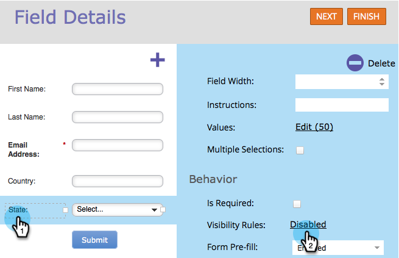
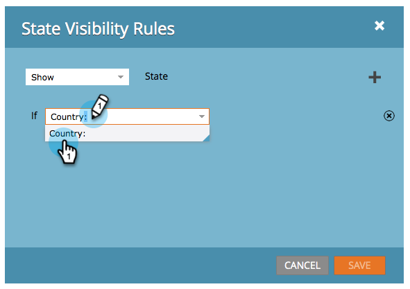
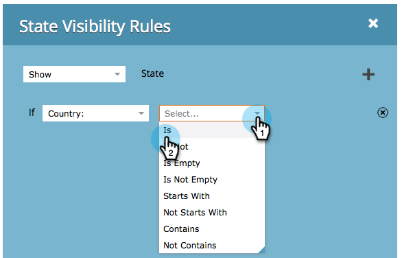
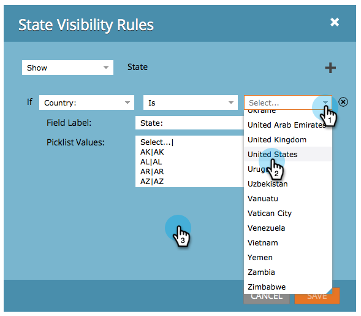
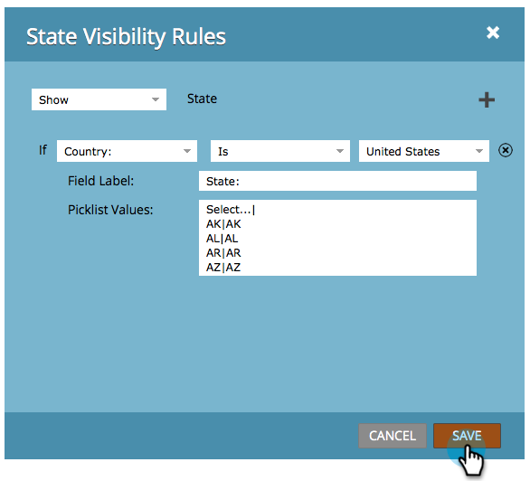

# Alternar dinamicamente a visibilidade de um campo de formulário {#dynamically-toggle-visibility-of-a-form-field}

>[!PREREQUISITES]
>
>* [Adicionar uma lista de opções do país ao seu formulário](/help/marketo/product-docs/demand-generation/forms/form-actions/add-a-country-picklist-to-your-form.md)

Um recurso muito interessante dos formulários do Marketo é que você pode ocultar/mostrar dinamicamente campos ou [conjuntos de campos](/help/marketo/product-docs/demand-generation/forms/form-fields/add-a-fieldset-to-a-form.md).

>[!NOTE]
>
>**Exemplo**
>
>Neste exemplo, vamos ocultar o campo **Estado**, a menos que **País** esteja selecionado como &quot;Estados Unidos&quot;.

1. Acesse **[!UICONTROL Atividades de marketing]**.

   

1. Selecione seu formulário e clique em **[!UICONTROL Editar Formulário]**.

   

1. Selecione o campo que deseja ocultar/mostrar dinamicamente e clique no link para **[!UICONTROL Regras de visibilidade]**.

   

1. Localize e selecione o campo no qual deseja criar uma condição.

   

1. Selecione o operador.

   >[!TIP]
   >
   >Isso é legal porque você pode escolher correspondências difusas como &quot;[!UICONTROL começa com]&quot;.

   

1. Selecione os valores a serem procurados e clique fora do menu suspenso.

   

   >[!TIP]
   >
   >Você pode selecionar vários valores clicando neles enquanto o menu suspenso estiver aberto. Por exemplo, você pode selecionar Estados Unidos e Canadá.

   >[!NOTE]
   >
   >Anteriormente convertemos País em um tipo de campo de lista de opções e [adicionamos todos os países como valores](/help/marketo/product-docs/demand-generation/forms/form-actions/add-a-country-picklist-to-your-form.md).

1. Clique em **[!UICONTROL Salvar]**.

   

E é isso! Agora, quando as pessoas preencherem este formulário e selecionarem Estados Unidos por país, o campo Estado aparecerá dinamicamente com as opções especificadas.

>[!IMPORTANT]
>
>O comportamento do campo de formulário funcionará perfeitamente quando os valores de campo forem definidos/atualizados por meio de script personalizado usando [funções de API](https://experienceleague.adobe.com/en/docs/marketo-developer/marketo/javascriptapi/forms-api-reference){target="_blank"} no Forms 2.0.
>
>Campos condicionais podem não funcionar como esperado se os valores de campo forem modificados por scripts externos diferentes da API do JavaScript do Forms 2.0.
