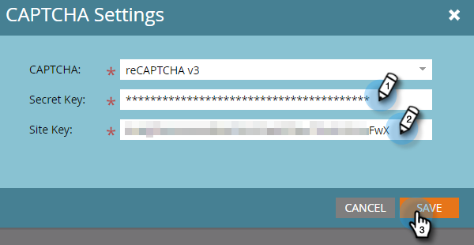

# Configuração do reCAPTCHA v3 {#setting-up-recaptcha-v3}

O ReCAPTCHA v3 é uma experiência sem atrito que classifica os envios de formulário com base no quão suspeitos eles são sem usar desafios de texto, imagem ou botão. [Saiba mais](https://developers.google.com/search/blog/2018/10/introducing-recaptcha-v3-new-way-to){target=&quot;_blank&quot;}.

## Recupere seu data center e a ID do Munchkin {#retrieve-your-data-center-and-munchkin-id}

Para a Etapa 6 da seção Configuração inicial do reCAPTCHA v3 abaixo, você precisará do data center e da ID do Munchkin da sua assinatura do Marketo Engage. Aqui está como encontrá-los.

1. No Marketo, clique em **Administrador**.

   

1. Clique em **Minha conta**.

   

1. Role para baixo até Informações de suporte.

   

## Configuração inicial do reCAPTCHA v3 {#initial-recaptcha-v3-setup}

As etapas a seguir são executadas fora do Marketo.

1. Ir para [https://www.google.com/recaptcha/about/](https://www.google.com/recaptcha/about/){target=&quot;_blank&quot;} e clique no Admin Console v3.

1. Faça logon/se inscreva em uma conta da Google.

1. Clique no botão Create (sinal de +) para criar uma nova chave.

1. Crie um rótulo para identificar a chave que deve ser usada para o Marketo Engage.

1. Escolher tipo **reCAPTCHA v3**. No momento, o Marketo Engage não é compatível com o reCAPTCHA v2.

1. Adicione cada domínio que a assinatura do Marketo Engage usa. Domínios não definidos aqui retornarão erros em formulários em que reCAPTCHA está ativado. Lembre-se de substituir as palavras &quot;datacenter&quot; e &quot;munchkinID&quot; por [dados na sua assinatura](#retrieve-your-data-center-and-munchkin-id).

   * app-datacenter.marketo.com
   * munchkinID.mktoweb.com
   * qualquer domínio de landing page e alias configurado na assinatura

   >[!NOTE]
   >
   >Como exemplo, se o Data Center da sua conta for &quot;sjst&quot;, o domínio que você lista de permissões seria `app-sjst.marketo.com`. Se a ID do Munchkin for 123-ABC-789, o domínio que você lista de permissões seria `123-ABC-789.mktoweb.com`.

1. Defina um proprietário e um endereço de email adicional que deve receber alertas sobre esse serviço.

1. Aceite os Termos de Serviço do reCAPTCHA.

1. Clique em **Enviar**.

   >[!NOTE]
   >
   >Mantenha a chave do site e a chave secreta acessíveis para a configuração do Marketo Engage.

## Configuração do CAPTCHA no Marketo Engage {#setting-up-captcha-in-marketo-engage}

>[!IMPORTANT]
>
>Depois de seguir essas etapas e [habilite CAPTCHA no primeiro formulário do Marketo](/help/marketo/product-docs/demand-generation/forms/using-captcha/enable-captcha-in-marketo-forms.md){target=&quot;_blank&quot;}, certifique-se de testar o formulário imediatamente, pois qualquer tipo de configuração incorreta na configuração do reCAPTCHA pode quebrar o formulário.

1. No Marketo, clique em **Administrador**.

   

1. Selecionar **CAPTCHA** na árvore.

   

1. Clique em **Editar** nas configurações CAPTCHA.

   

1. Clique no menu suspenso CAPTCHA e escolha reCAPTCHA v3.

   

1. Insira a chave secreta e a chave do site. Clique em **Salvar** quando concluído.

   

>[!MORELIKETHIS]
>
>[Habilitar CAPTCHA no Marketo Forms](/help/marketo/product-docs/demand-generation/forms/using-captcha/enable-captcha-in-marketo-forms.md)
