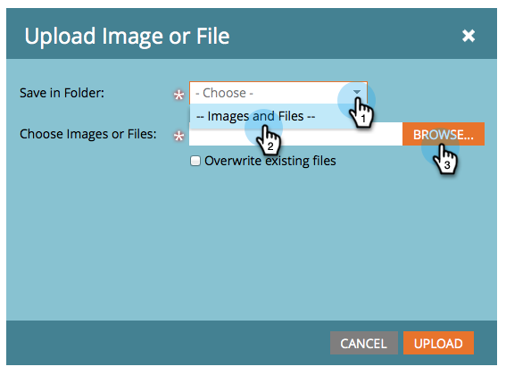

# Adicionar imagens e arquivos ao Marketo {#add-images-and-files-to-marketo}

Você tem várias opções para adicionar novos arquivos/imagens ao repositório Imagens e Arquivos.

## Carregar imagem ou arquivo {#upload-image-or-file}

1. Vá para a **Design Studio**.

   

1. Selecionar **[!UICONTROL Imagens e arquivos]**

   

1. Clique em **[!UICONTROL Ações de imagem e arquivo]** e selecione **[!UICONTROL Fazer upload de imagem ou arquivo]**.

   

1. Arraste e solte a imagem/arquivo desejado ou procure no computador.

   

1. Após selecionar o ativo, clique em **Carregar**.

   

## Importar imagem ou arquivo {#import-image-or-file}

Há três opções para importar uma imagem. Vamos analisar cada um deles.

### Importar da Web {#import-from-the-web}

Texto

1. Siga as etapas 1 e 2 [de cima](#upload-image-or-file).

1. Clique em **[!UICONTROL Ações de imagem e arquivo]** e selecione **[!UICONTROL Importar imagem ou arquivo]**.

   

1. Selecione o **Web** opção.

   

1. 

PICC

### Importar do Box {#import-from-box}

Texto

1. Siga as etapas 1 e 2 [de cima](#upload-image-or-file).

1. Clique em **[!UICONTROL Ações de imagem e arquivo]** e selecione **[!UICONTROL Importar imagem ou arquivo]**.

PICC

1. Texto

### Importar do Adobe Experience Manager {#import-from-adobe-experience-manager}

Texto

1. Siga as etapas 1 e 2 [de cima](#upload-image-or-file).

1. Clique em **[!UICONTROL Ações de imagem e arquivo]** e selecione **[!UICONTROL Importar imagem ou arquivo]**.

PICC

1. Texto

DOUTOR....

É fácil adicionar várias imagens e arquivos de uma só vez.

1. Vá para a **Design Studio**.

   

1. Em **Novo**, clique em **Fazer upload de imagem** ou **Arquivo**.

   

1. Selecione a pasta onde deseja armazenar as imagens ou os arquivos e clique em **Procurar**.

   

   >[!NOTE]
   >
   >O tamanho máximo por arquivo é de 100 MB.

1. Para adicionar várias imagens e arquivos, navegue até a pasta correta no computador e pressione **Ctrl/Cmd** e clique em cada arquivo que deseja adicionar e, em seguida, clique em **Abertura**.

   

1. Expanda a **Detalhes do arquivo** para verificar se você selecionou as imagens corretas, clique em **Carregar**.

   

   >[!NOTE]
   >
   >Para remover todos os arquivos em fila antes de fazer o upload, clique no x ao lado do nome do arquivo.

   >[!TIP]
   >
   >O Marketo verificará todos os arquivos antes de fazer upload; os arquivos infectados serão ignorados.

1. Quando o upload for concluído, clique em **Concluir**.

   

1. Suas imagens agora estão disponíveis para uso em emails da campanha e landing pages.

   

Muito bem!

>[!NOTE]
>
>Embora o Marketo aceite todos os tipos de arquivos para upload, somente os principais tipos de imagem (JPG, PNG, GIF etc.) funcionará em nosso editor de email.

>[!MORELIKETHIS]
>
>[Organize suas imagens e arquivos usando pastas](/help/marketo/product-docs/demand-generation/images-and-files/organize-your-images-and-files-using-folders.md)
