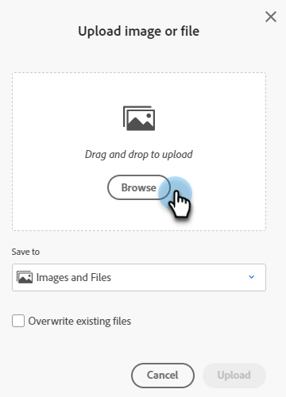

# Adicionar imagens e arquivos ao Marketo {#add-images-and-files-to-marketo}

Saiba como adicionar novas imagens ou arquivos à sua instância do Marketo Engage.

1. Vá para o **[!UICONTROL Design Studio]**.

   

1. Selecionar **[!UICONTROL Imagens e Arquivos]**

   

1. Clique no menu suspenso **[!UICONTROL Ações de imagem e arquivo]** e selecione **[!UICONTROL Carregar imagem ou arquivo]**.

   

1. Arraste e solte a imagem/arquivo desejado ou procure no computador.

   

   >[!NOTE]
   >
   >O tamanho máximo por arquivo é de 100 MB.

1. Após selecionar o ativo, clique em **Carregar**.

   

   >[!NOTE]
   >
   >Embora o Marketo aceite todos os tipos de arquivos para upload, somente os principais tipos de imagem (JPG, PNG, GIF etc.) funcionará no editor de email.

   >[!MORELIKETHIS]
   >
   >[Organize imagens e arquivos usando pastas](/help/marketo/product-docs/demand-generation/images-and-files/organize-your-images-and-files-using-folders.md){target="_blank"}
