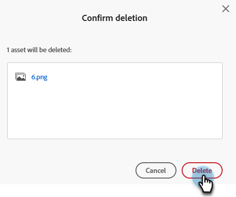

# Excluir uma imagem ou arquivo carregado {#delete-an-uploaded-image-or-file}

A exclusão de imagens ou arquivos é rápida e fácil.

>[!CAUTION]
>
>Após a exclusão, as imagens/arquivos são completamente removidos do Marketo Engage e não podem ser recuperados.

1. Vá para o **[!UICONTROL Design Studio]**.

   

1. Selecionar **[!UICONTROL Imagens e Arquivos]**

   

1. Localize e selecione a imagem/arquivo desejado. Clique no menu suspenso **[!UICONTROL Ações de imagem e arquivo]** e selecione **[!UICONTROL Excluir]**.

   

1. Verifique se você selecionou o arquivo correto e clique em **[!UICONTROL Excluir]**.

   

   >[!NOTE]
   >
   >O Assets não excluirá se estiverem em uso no momento.

>[!MORELIKETHIS]
>
>* [Substituir uma Imagem ou Arquivo Carregado](/help/marketo/product-docs/demand-generation/images-and-files/replace-an-uploaded-image-or-file.md){target="_blank"}
>* [Pesquisar Imagens e Arquivos Carregados](/help/marketo/product-docs/demand-generation/images-and-files/search-uploaded-images-and-files.md){target="_blank"}
>* [Localizar a URL de uma Imagem ou Arquivo Carregado](/help/marketo/product-docs/demand-generation/images-and-files/find-the-url-of-an-uploaded-image-or-file.md){target="_blank"}
