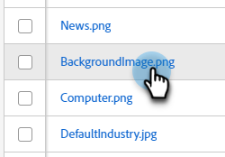

# Localizar o URL de uma imagem ou arquivo carregado {#find-the-url-of-an-uploaded-image-or-file}

Procurando o endereço da Web (URL) de uma imagem ou arquivo que você carregou?

1. Vá para o **[!UICONTROL Design Studio]**.

   

1. Clique em **[!UICONTROL Imagens e Arquivos]**.

   

1. Selecione o ativo desejado.

   

1. A **[!UICONTROL URL]** é exibida na página de detalhes.

   

>[!MORELIKETHIS]
>
>[Substituir uma Imagem ou Arquivo Carregado](/help/marketo/product-docs/demand-generation/images-and-files/replace-an-uploaded-image-or-file.md){target="_blank"}
