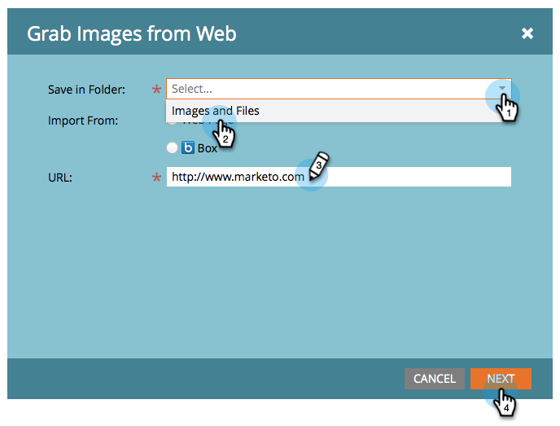

# Capturar imagens de uma página da Web {#grab-the-images-from-a-web-page}

Para adicionar imagens de uma página da Web, copie o endereço da Web (URL) da página que tem as imagens desejadas e, em seguida, siga estas etapas fáceis.

1. Vá para o **[!UICONTROL Design Studio]**.

   

1. Clique em **[!UICONTROL Novo]** e **[!UICONTROL Capturar imagens da Web]**.

   

1. Selecione a pasta **[!UICONTROL Imagens e Arquivos]**, cole o endereço Web (URL) na caixa de texto URL e clique em **[!UICONTROL Avançar]**.

   

   >[!NOTE]
   >
   >Esse recurso não funciona com URLs que apontam diretamente para uma imagem. Use o URL da página da Web que contém as imagens.

1. Selecione as imagens que deseja adicionar e clique em **[!UICONTROL Importar]**.

   

1. Suas imagens agora são importadas e estão disponíveis para uso em emails e landing pages.

   

1. Você pode ver todas as suas imagens disponíveis em **[!UICONTROL Imagens e Arquivos]**.

   

Bom trabalho, mestre da imagem!

>[!MORELIKETHIS]
>
>* [Adicionar Imagens e Arquivos ao Marketo](/help/marketo/product-docs/demand-generation/images-and-files/add-images-and-files-to-marketo.md)
>* [Organize imagens e arquivos usando pastas](/help/marketo/product-docs/demand-generation/images-and-files/organize-your-images-and-files-using-folders.md)
>* [Localizar a URL de uma Imagem ou Arquivo Carregado](/help/marketo/product-docs/demand-generation/images-and-files/find-the-url-of-an-uploaded-image-or-file.md)
>* [Carregar Imagens e Arquivos da Caixa](/help/marketo/product-docs/demand-generation/images-and-files/upload-images-and-files-from-box.md)
