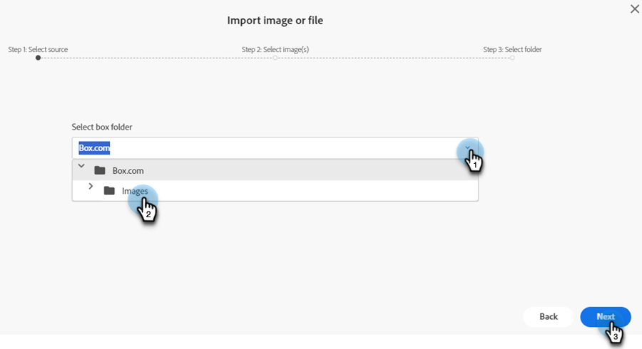

# Novo Documento Adicionar Imagens {#new-add-images-doc}

Você tem várias opções para adicionar novos arquivos/imagens ao repositório Imagens e Arquivos.

## Carregar imagem ou arquivo {#upload-image-or-file}

1. Vá para o **Design Studio**.

   

1. Selecionar **[!UICONTROL Imagens e Arquivos]**

   

1. Clique no menu suspenso **[!UICONTROL Ações de imagem e arquivo]** e selecione **[!UICONTROL Carregar imagem ou arquivo]**.

   

1. Arraste e solte a imagem/arquivo desejado ou procure no computador.

   

1. Após selecionar o ativo, clique em **Carregar**.

   

## Importar imagem ou arquivo {#import-image-or-file}

Há três opções para importar uma imagem. Vamos analisar cada um deles.

### Importar da Web {#import-from-the-web}

Texto

1. Siga as etapas 1 e 2 [de cima](#upload-image-or-file).

1. Clique no menu suspenso **[!UICONTROL Ações de imagem e arquivo]** e selecione **[!UICONTROL Importar imagem ou arquivo]**.

   

1. Selecione a opção **[!UICONTROL Web]** e clique em **[!UICONTROL Avançar]**.

   

1. Digite ou cole a URL para a imagem desejada e clique em **Avançar**.

PICC

1. Clique em BRANCO.

PICC

### Importar do Box {#import-from-box}

Texto

1. Siga as etapas 1 e 2 [de cima](#upload-image-or-file).

1. Clique no menu suspenso **[!UICONTROL Ações de imagem e arquivo]** e selecione **[!UICONTROL Importar imagem ou arquivo]**.

   

1. Selecione a opção **[!UICONTROL Caixa]** e clique em **[!UICONTROL Avançar]**.

   

   >[!NOTE]
   >
   >Se ainda não tiver feito isso, você será solicitado a fazer logon em sua conta do Box para conceder acesso.

1. Selecione a pasta Caixa desejada e clique em **[!UICONTROL Avançar]**.

   

1. Selecione as imagens desejadas e clique em **[!UICONTROL Avançar]**.

   

1. Selecione a pasta Marketo Engage na qual você deseja que a imagem seja salva. Neste exemplo, vamos deixá-lo como Imagens e arquivos (padrão). Clique em **Importar**.

   

### Importar do Adobe Experience Manager {#import-from-adobe-experience-manager}

Texto

1. Siga as etapas 1 e 2 [de cima](#upload-image-or-file).

1. Clique no menu suspenso **[!UICONTROL Ações de imagem e arquivo]** e selecione **[!UICONTROL Importar imagem ou arquivo]**.

   

1. Selecione a opção **[!UICONTROL Adobe Experience Manager]** e clique em **[!UICONTROL Avançar]**.

   

   >[!NOTE]
   >
   >Caso ainda não o tenha feito, você será solicitado a fazer logon em sua conta AEM.

1. Texto

PICC

1. Texto

PICC

1. Texto
