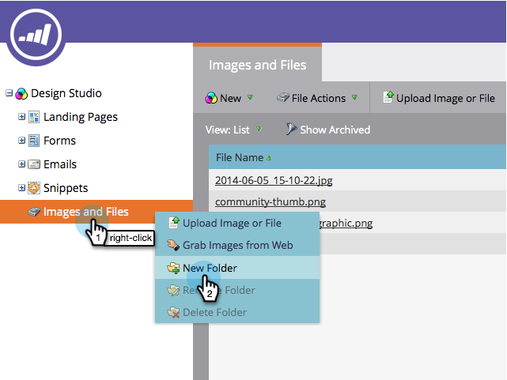

# Organize suas imagens e arquivos usando pastas {#organize-your-images-and-files-using-folders}

A criação de pastas permite que você mova imagens e arquivos, veja apenas o conjunto de imagens desejado e faça upload diretamente para uma pasta específica.

1. Vá para o **Design Studio**.

   

1. Clique com o botão direito do mouse em **Imagens e arquivos** no menu esquerdo e selecione **Nova pasta**.

   

1. Depois que a nova pasta for exibida, atribua um nome a ela.

   

1. Vá para **Imagens e Arquivos**, agora você pode arrastar e soltar na pasta desejada.

   

Alto cinco! Estão prontos para a utopia de pastas.

>[!MORELIKETHIS]
>
>[Pesquisar imagens e arquivos carregados](/help/marketo/product-docs/demand-generation/images-and-files/search-uploaded-images-and-files.md)
