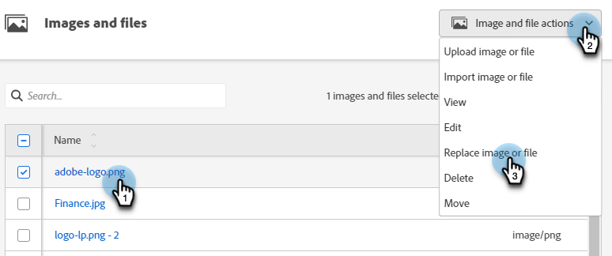

# Substituir uma imagem ou arquivo carregado {#replace-an-uploaded-image-or-file}

1. Vá para o **[!UICONTROL Design Studio]**.

   

1. Clique em **[!UICONTROL Imagens e Arquivos]**.

   

1. Selecione o ativo que deseja substituir. Clique no menu suspenso **[!UICONTROL Ações de imagem e arquivo]** e selecione **[!UICONTROL Substituir imagem ou arquivo]**.

   

1. Arraste e solte ou procure a imagem/arquivo de substituição no computador.

   

   >[!NOTE]
   >
   >O tipo de arquivo de substituição deve ser o mesmo do original (por exemplo, .jpg)

1. Após selecionar a imagem/arquivo de substituição, clique em **[!UICONTROL Substituir]**.

   

   >[!NOTE]
   >
   >O nome do arquivo de substituição será alterado para corresponder ao nome do arquivo anterior.

Bom trabalho!

>[!MORELIKETHIS]
>
>* [Pesquisar Imagens e Arquivos Carregados](/help/marketo/product-docs/demand-generation/images-and-files/search-uploaded-images-and-files.md){target="_blank"}
>* [Localizar a URL de uma Imagem ou Arquivo Carregado](/help/marketo/product-docs/demand-generation/images-and-files/find-the-url-of-an-uploaded-image-or-file.md){target="_blank"}
