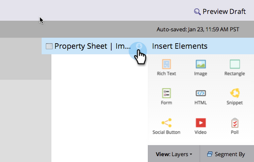

# Adicionar um link a uma imagem em uma página de destino de forma livre {#add-a-link-to-an-image-in-a-free-form-landing-page}

Para transformar uma imagem em uma página de aterrissagem em um link clicável, siga as etapas abaixo.

>[!PREREQUISITES]
>
>[Adicionar uma imagem a uma página de aterrissagem de forma livre](/help/marketo/product-docs/demand-generation/landing-pages/free-form-landing-pages/add-an-image-to-a-free-form-landing-page.md)

1. Clique na imagem à qual deseja adicionar um link.

   

1. Expanda a **[!UICONTROL Folha de Propriedades]**.

   

1. Copie ou digite o link na caixa **[!UICONTROL linkUrl]**.

   

   Você adicionou com sucesso um link para uma imagem em sua landing page. Agora você pode [visualizar a página](/help/marketo/product-docs/demand-generation/landing-pages/landing-page-actions/preview-a-landing-page.md) para vê-la em ação.

>[!TIP]
>
>Sempre teste suas páginas.
