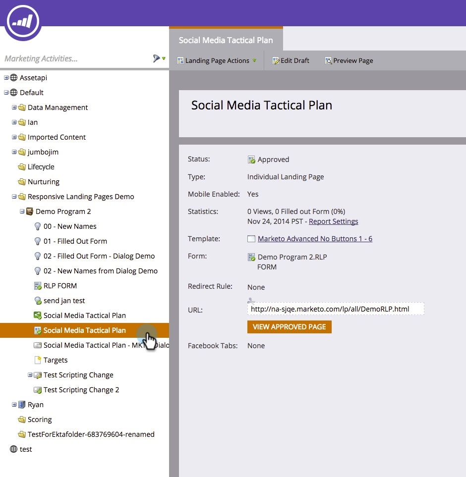
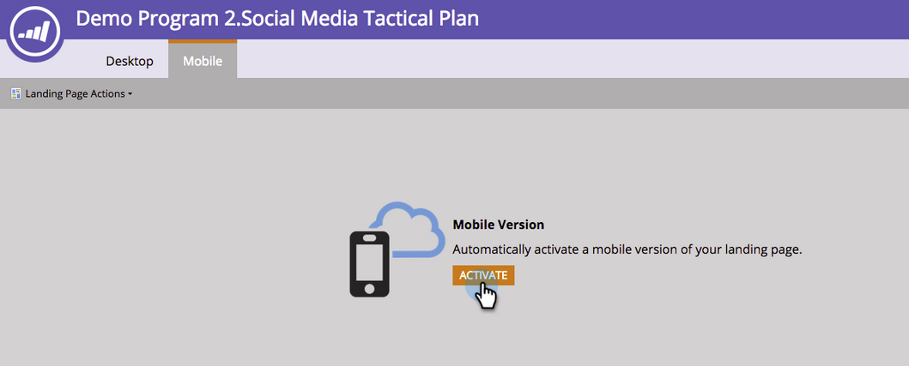

# Adicione uma Visualização móvel para sua Landing page de forma livre {#add-a-mobile-view-for-your-free-form-landing-page}

É fácil fazer com que suas landings page de forma livre fiquem excelentes em um smartphone.

>[!NOTE]
>
>A visualização móvel funciona em telas com largura de 480px (ou menos). Em outras palavras, smartphones. Veja mais [informações sobre resoluções de dispositivos](http://mydevice.io/devices/.).

1. Vá para **Atividades de marketing**.

   

1. Selecione uma landing page de forma livre.

   

1. Clique em **Editar rascunho**.

   

1. Clique na guia **Mobile**.

   

1. Clique em **Ativar**.

   

   >[!CAUTION]
   >
   >Talvez seja necessário atualizar o modelo de forma livre. Se você vir essa mensagem, leia rapidamente sobre como [tornar um modelo de landing page de forma livre existente compatível](../../../../product-docs/demand-generation/landing-pages/landing-page-templates/make-an-existing-free-form-landing-page-template-mobile-compatible.md).

1. Ótimo! Agora você ativou a versão móvel da sua landing page. Clique em **Fechar. **

   

   Agora você pode [personalizar sua visualização móvel](customize-mobile-view-for-your-free-form-landing-page.md).

   

>[!MORELIKETHIS]
>
>* [Personalize a Visualização móvel para sua Landing page de forma livre](customize-mobile-view-for-your-free-form-landing-page.md)

>

