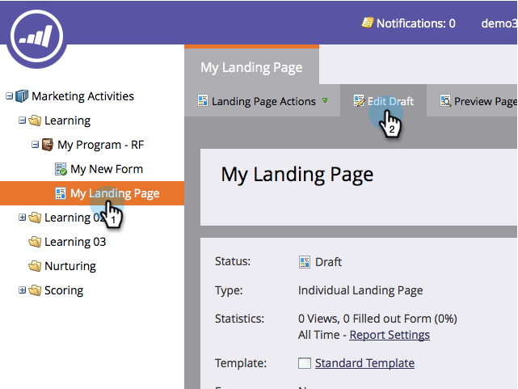

# Adicionar um novo formulário a uma Landing page de forma livre {#add-a-new-form-to-a-free-form-landing-page}

Formulário, conheça a landing page. Landing page, formulário.

>[!NOTE]
>
>**Pré-requisitos**
>
>* [Criar um formulário](../../../../product-docs/demand-generation/forms/creating-a-form/create-a-form.md)
>* [Criar uma Landing page de forma livre](create-a-free-form-landing-page.md)

>

1. Vá para **Marketing** **Atividade**.

   

1. Localize sua landing page e clique em **Editar** **rascunho**.

   

1. Arraste e solte o elemento **Formulário** na página.

   

1. Localize e selecione o formulário que deseja adicionar.

   

1. Você tem três opções ao escolher sua página de acompanhamento:

   * **landing page** - para escolher uma landing page de marketing
   * **URL** externo**** - para escolher qualquer URL que você deseja

   * **Formulário**** Definido** - para usar as configurações definidas no nível do formulário
   >[!NOTE]
   >
   >**Definição**
   >
   >
   >A página de acompanhamento é a página que as pessoas verão depois de enviarem o formulário.

1. Clique em **Inserir**.

   

   Muito bem!

Feche o editor de landings page e [aprove o rascunho](../../../../product-docs/demand-generation/landing-pages/understanding-landing-pages/approve-unapprove-or-delete-a-landing-page.md)da landing page.
