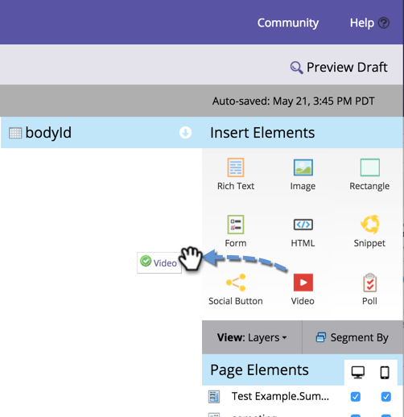
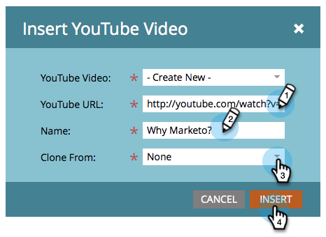

# Adicionar um vídeo a uma página de destino de forma livre {#add-a-video-to-a-free-form-landing-page}

Coloque vídeos com opções de compartilhamento em redes sociais nas páginas de aterrissagem.

>[!AVAILABILITY]
>
>Nem todos os usuários do Marketo Engage compraram essa funcionalidade. Entre em contato com a equipe de conta da Adobe (seu gerente de conta) para obter mais detalhes.

1. Navegue até a página de aterrissagem de forma livre e clique em **[!UICONTROL Editar rascunho]**.

   

1. Arraste sobre **[!UICONTROL Vídeo]** dos elementos à direita.

   

1. Selecione **[!UICONTROL Criar novo]** no menu suspenso.

   

   >[!NOTE]
   >
   >O recurso **[!UICONTROL Criar novo]** aparece somente em [!UICONTROL Atividades de marketing]; não está disponível no [!UICONTROL Design Studio]. Somente os vídeos já criados estão disponíveis no Design Studio. No entanto, você pode criar um compartilhamento de vídeo _dentro de um programa_ selecionando **[!UICONTROL Novo]** > **[!UICONTROL Novo ativo local]**. Você pode selecioná-la no menu suspenso, como mostrado aqui.

1. Insira o URL do vídeo do YouTube e nomeie o vídeo. No menu suspenso **[!UICONTROL Clonar de]**, selecione **[!UICONTROL Nenhum]** e clique em **[!UICONTROL Inserir]**.

   

>[!TIP]
>
>Para economizar tempo, você pode usar a opção **[!UICONTROL Clonar de]** para copiar todas as configurações de um compartilhamento de vídeo existente.

Você adicionou um compartilhamento de vídeo à sua página de aterrissagem de formato livre. Aprove a landing page e o compartilhamento de vídeo estará ativo. Você também pode [publicar a página de aterrissagem no Facebook](/help/marketo/product-docs/demand-generation/facebook/publish-landing-pages-to-facebook.md) ou colocar o compartilhamento de vídeo em seu site.
