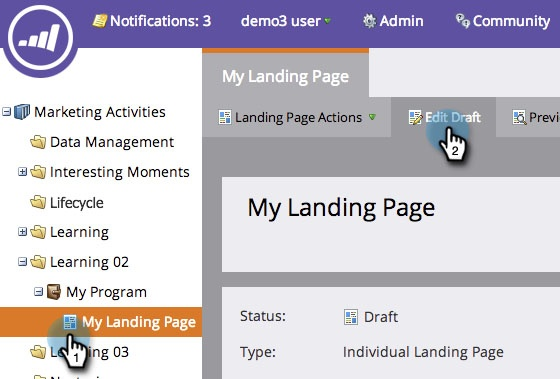

# Adicionar uma imagem a uma página de destino de forma livre {#add-an-image-to-a-free-form-landing-page}

>[!PREREQUISITES]
>
>[Adicionar Imagens e Arquivos ao Marketo](/help/marketo/product-docs/demand-generation/images-and-files/add-images-and-files-to-marketo.md)

1. Selecione sua página de aterrissagem de forma livre e clique em **[!UICONTROL Editar rascunho]**.

   

1. No editor, arraste sobre o elemento **[!UICONTROL Image]**.

   

1. Localize e selecione a imagem de sua escolha.

   

1. Clique em **[!UICONTROL Inserir]**.

   

   Excelente trabalho! Você acabou de adicionar uma imagem à sua página de aterrissagem de forma livre.

   
