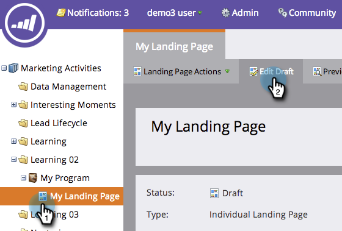

# Adição de um retângulo a uma landing page de forma livre {#adding-a-rectangle-to-a-free-form-landing-page}

Os retângulos nas páginas de aterrissagem são ótimos para realçar uma área do texto.

1. Selecione uma página de aterrissagem de forma livre e clique em **[!UICONTROL Editar rascunho]**.

   

   >[!NOTE]
   >
   >O designer da página de aterrissagem de forma livre é aberto em uma nova janela.

1. Arraste sobre o elemento **[!UICONTROL Retângulo]**.

   

1. Selecione o retângulo e use a **[!UICONTROL Folha de Propriedades]** para fazer as alterações necessárias.

   >[!TIP]
   >
   >Você pode mover e redimensionar o retângulo usando a função arrastar e soltar. Experimente também as setas no teclado! Dica: pressione a tecla Shift-Seta para mover o retângulo 10px de cada vez.

   

Parabéns! Agora você pode criar retângulos nas páginas de aterrissagem de forma livre.
