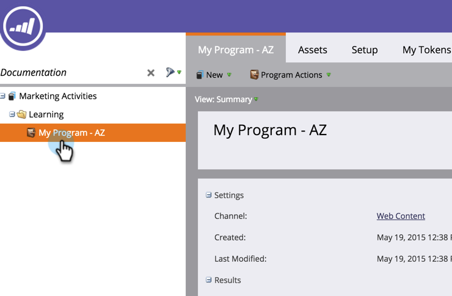

# Criar uma página de aterrissagem de forma livre {#create-a-free-form-landing-page}

Páginas de aterrissagem de forma livre podem ser criadas como ativos locais de um programa ou no [!UICONTROL Design Studio] para serem usadas globalmente.

>[!NOTE]
>
>Os modos de landing page são definidos pelo template. [Saiba mais](/help/marketo/product-docs/demand-generation/landing-pages/understanding-landing-pages/understanding-free-form-vs-guided-landing-pages.md) sobre modelos de página de aterrissagem guiados e de forma livre.

## Criar uma página de aterrissagem de forma livre em um programa {#create-a-free-form-landing-page-in-a-program}

1. Vá para **[!UICONTROL Atividades de marketing]**.

   

1. Clique em seu programa.

   

1. Clique em **[!UICONTROL Novo]**. Selecione **[!UICONTROL Novo ativo local]**.

   

1. Clique em **[!UICONTROL Página de aterrissagem]**.

   

1. Nomeie sua página de aterrissagem e escolha o modelo de formato livre no menu suspenso.

   >[!NOTE]
   >
   >Os modelos sem um ícone são de forma livre. Os modelos de forma livre permitem personalização completa.

   

1. Clique em **[!UICONTROL Criar]**.

   

>[!TIP]
>
>O URL é construído automaticamente a partir dos nomes do programa e da landing page. Para alterar a URL, edite o campo **[!UICONTROL URL da página]**.

## Criar uma página de aterrissagem de forma livre no Design Studio {#create-a-free-form-landing-page-in-design-studio}

1. Vá para o **[!UICONTROL Design Studio]**.

   

1. Clique em **[!UICONTROL Nova]** e depois em **[!UICONTROL Nova Página de Aterrissagem]**.

   

1. Nomeie sua página de aterrissagem e escolha o modelo de formato livre no menu suspenso.

   

1. Clique em **[!UICONTROL Criar]**.

   

>[!TIP]
>
>Desmarque &quot;[!UICONTROL Abrir editor de página de aterrissagem para a nova página]&quot; se não quiser que o editor seja aberto imediatamente após clicar em **[!UICONTROL Criar]**.
