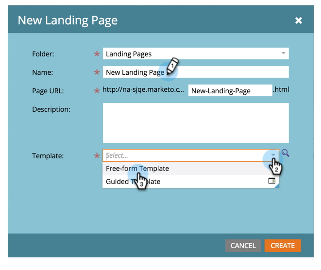

# Criar uma Landing page de forma livre {#create-a-free-form-landing-page}

Landings page de forma livre podem ser criadas como ativos locais de um programa ou no Design Studio para serem usadas globalmente.

>[!NOTE]
>
>Os modos de landing page são definidos pelo modelo. [Saiba ](/help/marketo/product-docs/demand-generation/landing-pages/understanding-landing-pages/understanding-free-form-vs-guided-landing-pages.md) mais sobre os modelos de landing page de forma livre e guiada.

## Criar uma Landing page de forma livre em um Programa {#create-a-free-form-landing-page-in-a-program}

1. Vá para **Atividades de marketing**.

   

1. Clique em seu programa.

   

1. Clique em **Novo**. Selecione **Novo ativo local**.

   

1. Clique em **Landing page**.

   

1. Nomeie sua landing page e escolha um modelo de formulário livre no menu suspenso.

   >[!NOTE]
   >
   >Os modelos sem um ícone são de forma livre. Os modelos de forma livre permitem personalização completa.

   

1. Clique em **Criar**.

   

>[!TIP]
>
>O URL é construído automaticamente a partir dos nomes de programa e landing page. Para alterar o URL, edite o campo **URL da página**.

## Criar uma Landing page de forma livre no Design Studio {#create-a-free-form-landing-page-in-design-studio}

1. Vá para o **Design Studio**.

   

1. Clique em **Nova**, em seguida, **Nova Landing page**.

   

1. Nomeie sua landing page e escolha um modelo de formulário livre no menu suspenso.

   

1. Clique em **Criar**.

   

>[!TIP]
>
>Desmarque &quot;Abrir editor de landing page para nova página&quot; se não quiser que o editor abra imediatamente depois de clicar em **Criar**.
