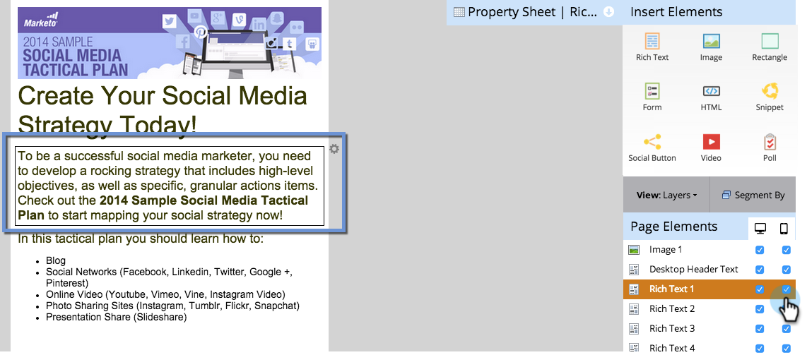
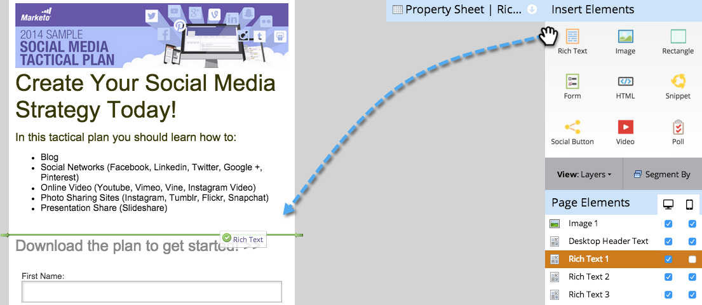

# Personalizar visualização móvel de uma página de destino de forma livre {#customize-mobile-view-for-your-free-form-landing-page}

>[!PREREQUISITES]
>
>[Adicionar um Modo de Exibição Móvel para sua Página de Aterrissagem de Formato Livre](/help/marketo/product-docs/demand-generation/landing-pages/free-form-landing-pages/add-a-mobile-view-for-your-free-form-landing-page.md)

A visualização móvel da página de aterrissagem de formato livre é em sua maioria automática, mas você pode personalizá-la. Veja como.

1. Selecione a página de aterrissagem de formato livre.

   

1. Clique em **[!UICONTROL Editar rascunho]**.

   

1. Clique na guia **[!UICONTROL Mobile]**.

   

## Exibição móvel vs. desktop {#mobile-vs-desktop-view}

Em Elementos da página, você verá um ícone do  (desktop) e um ícone do  (dispositivos móveis). Isso permite mostrar/ocultar elementos diferentes dinamicamente.

Por padrão, tudo na exibição da área de trabalho é mostrado na exibição móvel.

>[!NOTE]
>
>Os retângulos não são mostrados na exibição móvel.

## Informações importantes a saber: {#important-things-to-know}

* As imagens serão expandidas para a largura do seu dispositivo móvel. Se desejar imagens menores, puxe o elemento rich text e adicione a imagem a partir desse ponto.
* Use somente formulários do Forms 2.0. Eles são responsivos e se ajustarão automaticamente.
* Somente um elemento de modelo é editável, BODY#bodyid (Dispositivo móvel). Você pode usar isso para alterar a cor do plano de fundo.

  

## Ocultar um elemento da exibição móvel {#hide-an-element-from-the-mobile-view}

>[!TIP]
>
>Menos significa mais em dispositivos móveis. Use menos palavras para clientes mais satisfeitos.

1. Para ocultar um elemento, clique na caixa de seleção correspondente na coluna Dispositivo móvel.

   

1. Perfeito! Esse elemento não estará mais visível na visualização móvel.

   

## Adicionar um elemento à visualização móvel {#add-an-element-to-the-mobile-view}

>[!TIP]
>
>Faça conteúdo especial (mais curto) apenas para a visualização móvel.

1. Para adicionar um elemento, arraste-o e solte-o na landing page de forma livre.

   

   Verifique se o elemento está definido para exibição somente na exibição móvel.

   

>[!TIP]
>
>A visualização móvel também pode ter uma disposição diferente de elementos da página. Mova tudo na página de aterrissagem de forma livre ou reordene os objetos listados em **[!UICONTROL Elementos da página]** usando a função arrastar e soltar.

## Visualizar exibição móvel {#preview-mobile-view}

1. Clique em **[!UICONTROL Visualizar Rascunho]**.

   

1. Quer ver algo legal? Selecione **[!UICONTROL Lado A Lado]**.

   

1. Agora você pode ver as versões para desktop e para dispositivos móveis de suas landing pages ao mesmo tempo.

   

1. Se você gostou, clique em **[!UICONTROL Aprovar e Fechar]**.

   

   >[!NOTE]
   >
   >A visualização não é interativa. Cada smartphone exibe as coisas de forma um pouco diferente. Recomendamos visualizar sua landing page em alguns dispositivos para ver exatamente como ela se comportará.

Divirta-se!

>[!MORELIKETHIS]
>
>[Tornar um Modelo de Página de Aterrissagem de Formato Livre Existente Compatível com Dispositivos Móveis](/help/marketo/product-docs/demand-generation/landing-pages/landing-page-templates/make-an-existing-free-form-landing-page-template-mobile-compatible.md)
