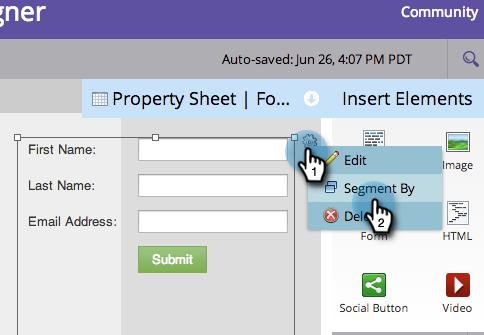

# Usar conteúdo dinâmico em uma página de destino de forma livre {#use-dynamic-content-in-a-free-form-landing-page}

O uso do conteúdo dinâmico nas páginas de aterrissagem envolve seu público-alvo com informações direcionadas.

>[!PREREQUISITES]
>
>* [Criar uma segmentação](/help/marketo/product-docs/personalization/segmentation-and-snippets/segmentation/create-a-segmentation.md)
>* [Criar uma Página de Aterrissagem de Formato Livre](/help/marketo/product-docs/demand-generation/landing-pages/free-form-landing-pages/create-a-free-form-landing-page.md)
>* [Adicionar um Novo Formulário a uma Página de Aterrissagem de Formato Livre](/help/marketo/product-docs/demand-generation/landing-pages/free-form-landing-pages/add-a-new-form-to-a-free-form-landing-page.md)

## Adicionar segmentação {#add-segmentation}

1. Vá para **[!UICONTROL Atividades de marketing]**.

   

1. Selecione sua Landing Page e clique em **[!UICONTROL Editar rascunho]**.

   

1. Clique em **[!UICONTROL Segmentar por]**.

   

1. Insira o nome da [!UICONTROL Segmentação] e clique em **[!UICONTROL Salvar]**.

   

1. Sua segmentação e seus segmentos aparecem em [!UICONTROL Dinâmico] à direita.

   

>[!NOTE]
>
>Todos os elementos da página de aterrissagem são estáticos por padrão.

## Tornar o elemento dinâmico {#make-element-dynamic}

1. Arraste e solte os elementos de conteúdo dinâmico de **[!UICONTROL Estático]** para **[!UICONTROL Dinâmico]**.

   

1. Você também pode tornar os elementos **[!UICONTROL Estáticos]** ou **[!UICONTROL Dinâmicos]** do elemento **[!UICONTROL Configurações]**.

   

## Aplicar conteúdo dinâmico {#apply-dynamic-content}

1. Selecione um elemento em um segmento, clique no ícone de configurações e em **[!UICONTROL Editar]**. Repita o procedimento para cada segmento.

   

1. Uma marca de seleção verde indica o conteúdo específico desse segmento. Um em branco indica o conteúdo padrão do segmento.

   

>[!CAUTION]
>
>As alterações no bloco de conteúdo Segmento padrão são aplicadas a todos os segmentos.

>[!TIP]
>
>Crie uma landing page padrão antes de modificar o conteúdo para os vários segmentos.

Voila! Agora você pode enviar conteúdo direcionado.

>[!MORELIKETHIS]
>
>* [Visualizar uma Página de Aterrissagem com Conteúdo Dinâmico](/help/marketo/product-docs/demand-generation/landing-pages/landing-page-actions/preview-a-landing-page-with-dynamic-content.md)
>* [Usando Conteúdo Dinâmico em um Email](/help/marketo/product-docs/email-marketing/general/functions-in-the-editor/using-dynamic-content-in-an-email.md)
