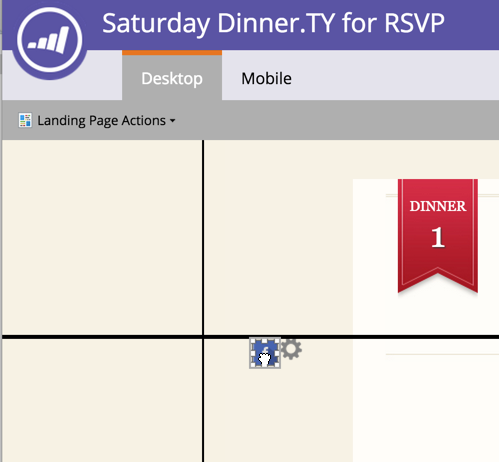

# Usar guias para design de uma página de destino de forma livre {#use-guides-for-free-form-landing-page-design}

Ao criar uma página de aterrissagem de forma livre, você pode usar guias para ajudar a alinhar elementos na página.

>[!NOTE]
>
>Os guias só estão disponíveis no editor de página de aterrissagem do **[!UICONTROL Formato livre]**.

1. Selecione uma **[!UICONTROL Landing Page]** e clique em **[!UICONTROL Editar rascunho]**.

   

1. Clique em **[!UICONTROL Ações da página de aterrissagem]** e selecione **[!UICONTROL Mostrar guias]**.

   

1. Uma guia vertical e horizontal será exibida sobre a tela de desenho. Use o cursor para movê-los.

   

1. Arraste um objeto sobre a linha. Solte quando a linha dobrar em largura e o objeto se encaixar na guia.

   

   Elementos corretamente alinhados criam um layout mais limpo e profissional.
