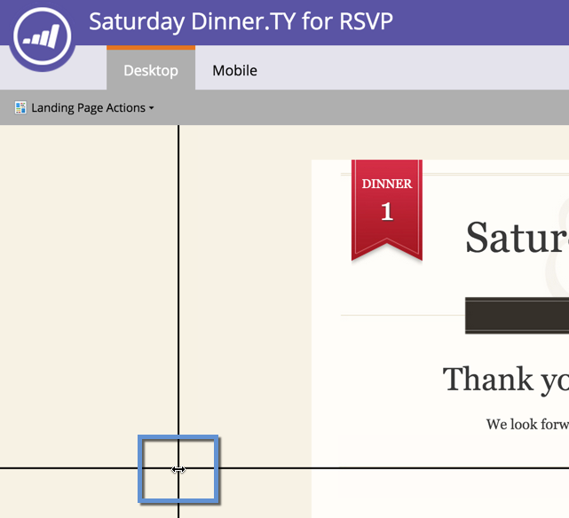

# Usar guias para design de Landing page de forma livre {#use-guides-for-free-form-landing-page-design}

Ao projetar uma landing page de forma livre, você pode usar guias para ajudar a alinhar os componentes.

>[!NOTE]
>
>As guias só estão disponíveis no editor de landings page **Free**-**form**.

1. Selecione uma **Landing page** e clique em **Editar rascunho**.

   

1. Clique em **Ações de Landing page **e selecione **Mostrar guias**.

   

1. Uma guia vertical e horizontal será exibida sobre a tela de desenho. Use o cursor para movê-los.

   

1. Arraste um objeto sobre a linha. Solte quando a linha duplo na largura e o objeto se ajusta à guia.

   

   Objetos alinhados são fáceis nos olhos!

