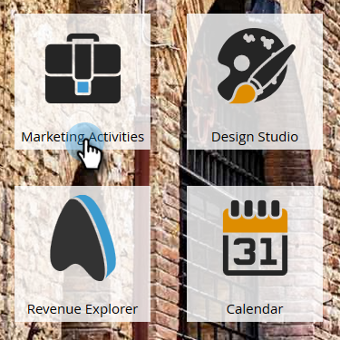
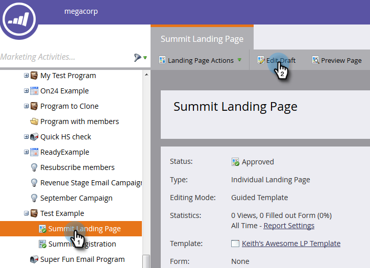
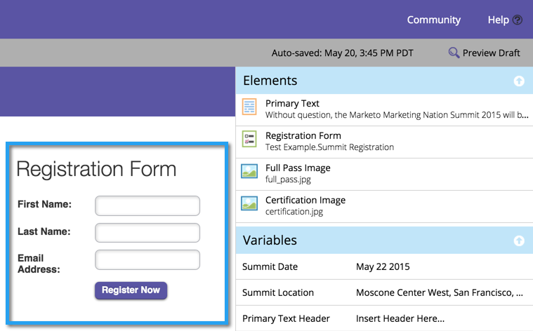

# Adicionar um formulário a uma página de destino guiada {#add-a-form-to-a-guided-landing-page}

>[!PREREQUISITES]
>
>[Criar uma página de aterrissagem guiada](/help/marketo/product-docs/demand-generation/landing-pages/guided-landing-pages/create-a-guided-landing-page.md)

1. Acesse a área **[!UICONTROL Atividades de marketing]**.

   

1. Localize e selecione sua página de aterrissagem e clique em **[!UICONTROL Editar Rascunho]**.

   

   >[!NOTE]
   >
   >Os elementos disponíveis nas páginas de aterrissagem guiadas são definidos pelo template. Se você não vir um formulário no painel Elementos, selecione um novo modelo ou fale com o criador do modelo.

1. Clique duas vezes no **Formulário** no painel de elementos.

   

1. Selecione o formulário que deseja adicionar.

   

1. Você tem três opções ao escolher a página de acompanhamento:

   * **[!UICONTROL Página de aterrissagem]** - escolha uma página de aterrissagem do Marketo
   * **[!UICONTROL URL externa]** - escolha a URL desejada
   * **[!UICONTROL Formulário definido]** - use as configurações definidas no nível do formulário

   >[!NOTE]
   >
   >A página de acompanhamento é a página que as pessoas verão depois de enviar o formulário.

1. Neste exemplo, selecione [!UICONTROL Formulário definido]. Clique em **[!UICONTROL Inserir]**.

   

   

Feche o editor de páginas de aterrissagem e [aprove o rascunho](/help/marketo/product-docs/demand-generation/landing-pages/understanding-landing-pages/approve-unapprove-or-delete-a-landing-page.md) da página de aterrissagem.
