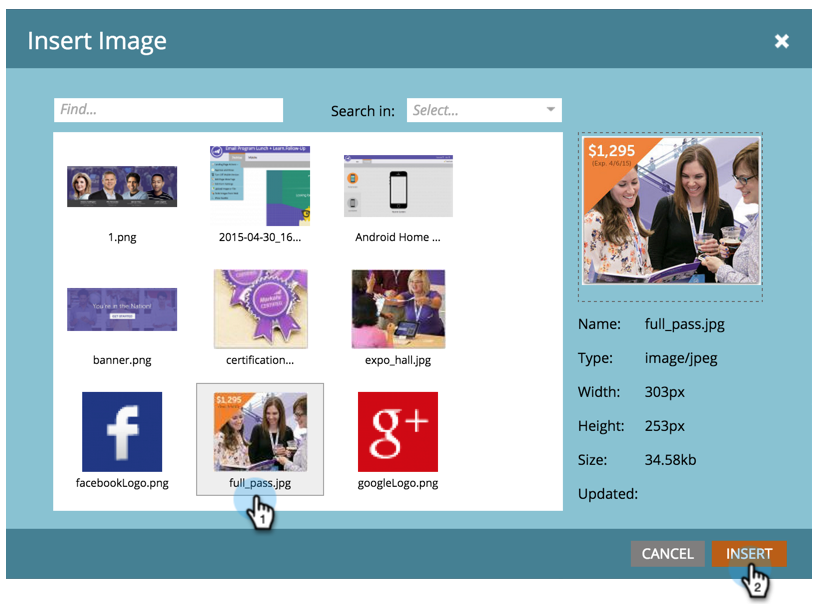

# Adicionar uma imagem a uma Landing page guiada {#add-an-image-to-a-guided-landing-page}

Ao contrário das landings page de forma livre, as landings page guiadas têm espaços predefinidos e bloqueados onde você adiciona imagens.

1. Selecione uma landing page guiada. Clique em **Editar rascunho**.

   

1. Clique na imagem que deseja editar. O espaço reservado do elemento acenderá na tela da landing page.

   

1. Selecione a imagem desejada e clique em **Inserir**.

   

1. O conteúdo será exibido no espaço reservado do elemento.

   >[!NOTE]
   >
   >A forma como a imagem é redimensionada depende do modelo. Saiba mais sobre Modelos [de Landing page](../../../../product-docs/demand-generation/landing-pages/landing-page-templates/create-a-guided-landing-page-template.md)guiada.

   

   >[!TIP]
   >
   >No momento, não há suporte para a especificação de um link para uma imagem no editor. Em vez disso, use um elemento Rich Text.

