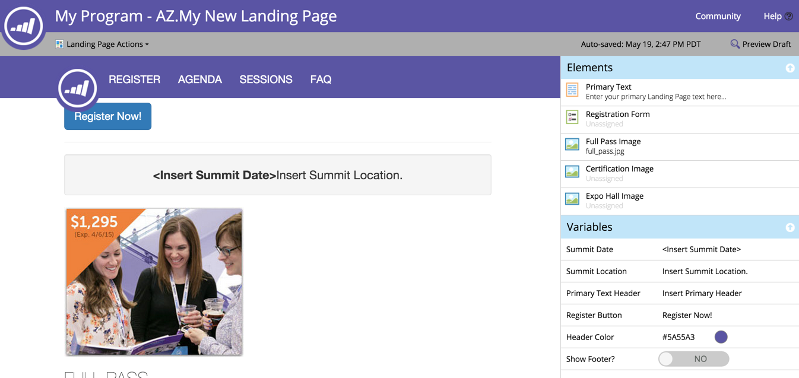

# Adicionar uma imagem a uma página de destino guiada {#add-an-image-to-a-guided-landing-page}

Diferentemente das páginas de aterrissagem de forma livre, as páginas de aterrissagem guiadas têm espaços predefinidos e bloqueados onde você adiciona imagens.

1. Selecione uma landing page guiada. Clique em **[!UICONTROL Editar rascunho]**.

   

1. Clique na imagem que deseja editar. O espaço reservado do elemento se iluminará na tela da página de aterrissagem.

   

1. Selecione a imagem desejada e clique em **[!UICONTROL Inserir]**.

   

1. O conteúdo será exibido no espaço reservado para elemento.

   >[!NOTE]
   >
   >A forma como a imagem é redimensionada depende do modelo. Saiba mais sobre [Modelos de página de aterrissagem guiados](/help/marketo/product-docs/demand-generation/landing-pages/landing-page-templates/create-a-guided-landing-page-template.md).

   

   >[!TIP]
   >
   >No momento, não há suporte para a especificação de um link para uma imagem no editor. Em vez disso, use um elemento rich text.
