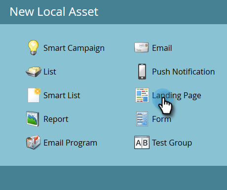

# Criar uma landing page guiada {#create-a-guided-landing-page}

>[!NOTE]
>
>Os modos de landing page são definidos pelo template. [Saiba mais](/help/marketo/product-docs/demand-generation/landing-pages/understanding-landing-pages/understanding-free-form-vs-guided-landing-pages.md) sobre modelos de página de aterrissagem guiados e de forma livre.

>[!PREREQUISITES]
>
>Para usar um modelo personalizado, primeiro [crie um modelo de página de aterrissagem guiado](/help/marketo/product-docs/demand-generation/landing-pages/landing-page-templates/create-a-guided-landing-page-template.md).

## Criar uma página de aterrissagem guiada em um programa {#create-a-guided-landing-page-in-a-program}

As páginas de aterrissagem guiadas podem ser criadas como ativos locais de um programa ou no Design Studio para serem usadas globalmente.

1. Vá para **Atividades de marketing**.

   

1. Selecione seu programa.

   

1. Clique no menu suspenso **Novo**. Selecione **Novo ativo local**.

   

1. Selecione **Página Inicial**.

   

1. Nomeie sua página de aterrissagem. Clique no menu suspenso **Modelo** e selecione **Modelo Guiado**.

   >[!NOTE]
   >
   >Os modelos de página de aterrissagem guiados têm o ícone  ao lado deles. Os modelos guiados são estruturados para que possam permanecer totalmente responsivos.

   

## Criar uma página de aterrissagem no Design Studio {#create-a-landing-page-in-design-studio}

1. Vá para o **Design Studio**.

   

1. Clique no menu suspenso **Novo**. Selecione **Nova Página De Aterrissagem**.

   

1. Nomeie sua página de aterrissagem. Clique no menu suspenso **Modelo** e selecione **Modelo Guiado**.

   

1. Clique em **Criar**.

   

>[!TIP]
>
>O URL é construído automaticamente a partir dos nomes do programa e da landing page. Para alterar a URL, edite o campo **URL da página**.
>
>Desmarque a caixa de seleção **Abrir no editor** se não quiser que o editor seja aberto imediatamente após clicar em **Criar**.
