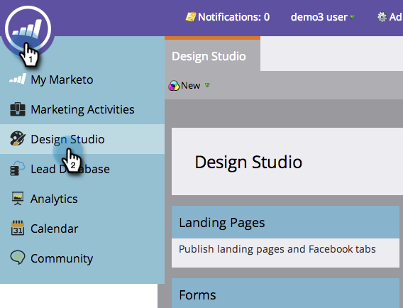

# Aprovar várias páginas de aterrissagem de uma vez {#approve-multiple-landing-pages-at-once}

1. Vá para o **Design Studio**.

   

1. Clique em **Landing Pages**.

   

1. Mantenha pressionada a tecla Ctrl (Windows) ou Command (Mac) e clique para selecionar várias landing pages.

   

   >[!TIP]
   >
   >Não clique no nome real da landing page; esses são links e direcionarão você à própria página.

1. Com suas páginas de aterrissagem selecionadas, vá para **Ações da página de aterrissagem** e clique em **Aprovar**.

   

   Lá vai você! Agora é possível aprovar várias landing pages de maneira rápida e fácil.

   

   >[!TIP]
   >
   >Também é possível usar as etapas acima para outras opções em massa, como cancelar aprovação ou excluir.
