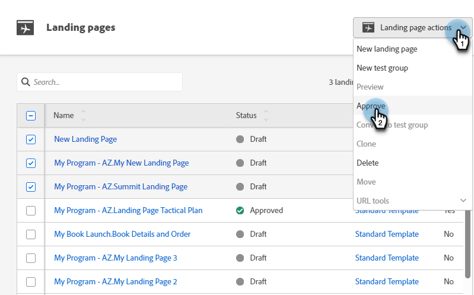

# Aprovar várias páginas de destino de uma vez {#approve-multiple-landing-pages-at-once}

1. Vá para o **[!UICONTROL Design Studio]**.

   

1. Clique em **[!UICONTROL Landing Pages]**.

   

1. Selecione as Landing Pages desejadas.

   

   >[!TIP]
   >
   >Não clique no nome real da Landing Page; esses são links e direcionarão você até a própria página.

1. Com suas Páginas de Aterrissagem selecionadas, clique no menu suspenso **[!UICONTROL Ações da Página de Aterrissagem]** e selecione **[!UICONTROL Aprovar]**.

   

1. Clique em **[!UICONTROL Aprovar]**.

   

   >[!TIP]
   >
   >Também é possível usar as etapas acima para outras opções em massa, como cancelar aprovação ou excluir.
