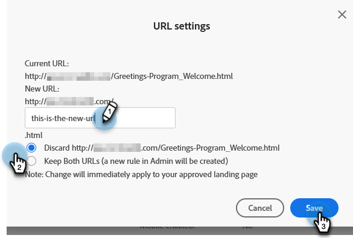

# Alterar o URL da landing page {#change-the-landing-page-url}

Você pode modificar o URL de uma landing page. Isso pode ajudar a tornar o URL mais fácil de lembrar e melhorar o SEO.

1. Localize e selecione a Landing page desejada.

   

1. Clique em **Ações da landing page** lista suspensa, role até **Ferramentas de URL** e selecione **Configurações de URL**.

   

1. Insira o **Novo URL**, opte por descartar ou redirecionar o URL antigo e clique em **Salvar**.

   

   >[!NOTE]
   >
   >Se você decidir manter ambos os URLs, uma regra de redirecionamento será criada automaticamente. Saiba mais sobre [Redirecionamentos de URL](/help/marketo/product-docs/demand-generation/landing-pages/personalizing-landing-pages/redirect-a-url-path.md).
