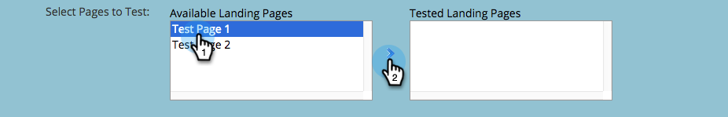

# Clonando um grupo de teste de Landing page {#cloning-a-landing-page-test-group}

No Design Studio, você pode encontrar e duplicado um grupo de teste de landing page.

1. Clique com o botão direito do mouse em uma página não aprovada. Selecione **Clonar**.

   

1. Dê a esta página clonada um novo **Nome**. As páginas clonadas aparecem na parte inferior da pasta atual.

   

1. Agora, crie um novo grupo de teste clicando em **Novo** e selecionando **Novo grupo de teste**.

   

1. Na caixa de diálogo Criar novas Landings page, digite o novo grupo de teste **Nome**.

   

1. Na parte inferior da caixa de diálogo, selecione as páginas clonadas na lista **Landings page disponíveis** e clique na seta que aponta para a direita para incluí-la nas **Landings page testadas**. Faça isso para todas as landings page que desejar neste grupo.

   

1. Quando terminar, clique em **Criar.**

   

1. Quando estiver pronto para iniciar o grupo de teste, clique com o botão direito do mouse no grupo na árvore e selecione **Aprovar grupo de teste**.

   

   O grupo agora rastreará ativamente as visitas e as conclusões do formulário, para que você possa ver qual landing page tem melhor desempenho.

