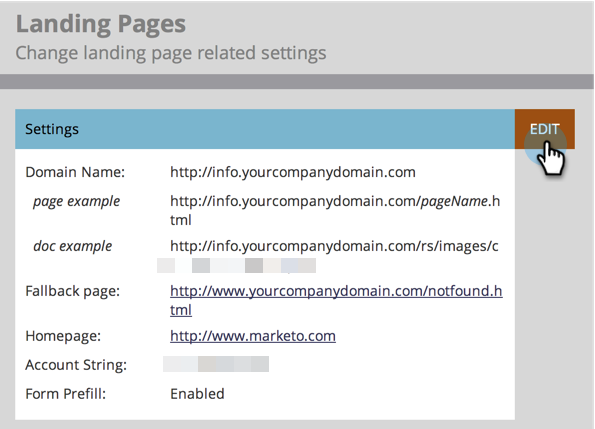

# Personalizar os URLs da sua landing page com um CNAME {#customize-your-landing-page-urls-with-a-cname}

Embora o Marketo hospede suas páginas de aterrissagem, o URL pode ser totalmente personalizado. Como se parece sem um CNAME:

`https://na-sj02.marketo.com/lp/mktodemoaccount126/UnsubscribePage.html`

A aparência desejada:

`https://go.YourCompany.com/UnsubscribePage.html`

## Escolha um CNAME {#choose-a-cname}

Escolha uma palavra para ir no início do URL das páginas de aterrissagem. É apenas uma palavra e deve ser relativamente curta. Exemplos:

* go.YourCompany.com/NameOfPage.html
* info.YourCompany.com/NameOfPage.html
* pages.YourCompany.com/NameOfPage.html

A palavra (mais YourCompany.com) é chamada de CNAME. Você precisará disso mais tarde, então anote-o.

## Encontrar a Munchkin ID {#find-your-munchkin-id}

1. Vá para a área **Administrador**.

   

1. Clique em **Minha conta**.

   

   >[!NOTE]
   >
   >**Permissões de administrador necessárias**

1. Role para baixo até &quot;Informações de suporte&quot; e copie sua Munchkin ID.

   

## Enviar solicitação para TI {#send-request-to-it}

Peça à sua equipe de TI para configurar o seguinte CNAME: (Substitua a palavra [CNAME] e [Munchkin ID] pelo texto da etapa anterior.)

[CNAME].YourCompany.com > [Munchkin ID].mktoweb.com

## Concluir configuração de CNAME {#complete-cname-setup}

1. Depois que o departamento de TI criar o CNAME, vá para a área **Administrador**.

   

1. Clique em **Landing Pages**.

   

1. Na seção **Configurações**, clique em **Editar**.

   

1. Digite seu CNAME em **[!UICONTROL Nome do domínio para Páginas de Aterrissagem]**, digite sua **[!UICONTROL Página de fallback]**, digite sua **[!UICONTROL Página inicial]** e clique em **[!UICONTROL Salvar]**.

   

>[!NOTE]
>
>Sua página de fallback será a página para a qual os leads serão redirecionados se a sua página de aterrissagem do Marketo não estiver disponível.

Excelente! As páginas de aterrissagem agora são marcadas com o domínio da empresa.
