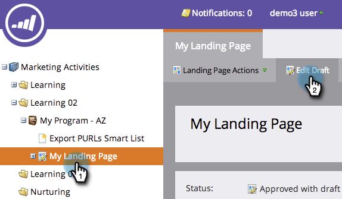

# Editar título e metadados da página de destino {#edit-landing-page-title-and-metadata}

O Marketo permite editar as [metatags da página de aterrissagem para fins de SEO](https://www.w3schools.com/tags/tag_meta.asp), bem como personalizar a parte `<head>` da HTML.

1. Selecione uma página de aterrissagem e clique em **[!UICONTROL Editar rascunho]**.

   

   >[!NOTE]
   >
   >O designer da landing page será aberto em uma nova janela.

1. Em **[!UICONTROL Ações da página de aterrissagem]**, clique em **[!UICONTROL Editar marcas de Meta da página]**.

   

1. Insira o **[!UICONTROL Título]**, **[!UICONTROL Palavras-chave]** e **[!UICONTROL Descrição]** da sua página. Selecione a opção desejada **[!UICONTROL Robôs]** e insira qualquer conteúdo personalizado que desejar para a seção `<head>` do HTML. Clique em **[!UICONTROL Salvar]**.

   

   >[!TIP]
   >
   >**O que significam [robôs](https://www.robotstxt.org/meta.html)?**
   >
   >**índice**: a página pode ser pesquisada na Web. **seguir**: os mecanismos de pesquisa podem seguir links em páginas indexadas.

1. Edite as tags a qualquer momento e aprove a landing page.
