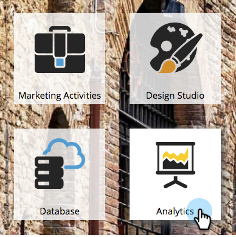

# Filtrar um relatório de desempenho de Landing page {#filter-a-landing-page-performance-report}

Focalize seu relatório [de desempenho de](../../../../product-docs/demand-generation/landing-pages/understanding-landing-pages/landing-page-performance-report.md) landing page nas landings page (ativos locais), no Design Studio (ativos globais) ou naquelas que foram arquivadas.

1. Vá para **Analytics** (ou **Marketing Atividade**).

   

1. Selecione seu relatório de landing page na árvore de navegação.

   

1. Clique na guia **Configuração** e arraste um filtro.

   

   * **Landings page do Design Studio:** Ativos globais, gerenciados no Design Studio.
   * **Landings page de Atividades de marketing:** Ativos locais em programas na guia Atividades de marketing.
   * **Landings page arquivadas:** Landings page inativas e reformadas.

1. Escolha as pastas e landings page específicas a serem incluídas em seu relatório.

   

   >[!TIP]
   >
   >Se você selecionar uma pasta, seu relatório incluirá tudo o que essa pasta contém no momento em que o relatório é executado.

1. Você terminou! Clique na guia **Relatório** para ver seu relatório filtrado.

   

>[!NOTE]
>
>**Mergulho profundo**
>
>Saiba tudo sobre os relatórios no relatórios básico.

