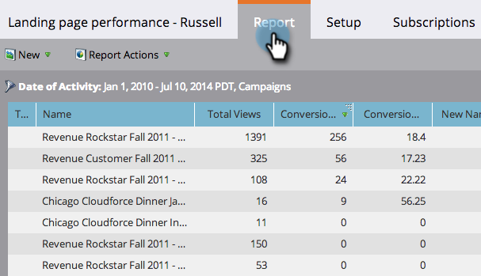

# Filtrar um relatório de desempenho de página de destino {#filter-a-landing-page-performance-report}

Concentre seu [relatório de desempenho da página de aterrissagem](/help/marketo/product-docs/demand-generation/landing-pages/understanding-landing-pages/landing-page-performance-report.md) nas páginas de aterrissagem de seus programas (ativos locais), no [!UICONTROL Design Studio] (ativos globais) ou naquelas que foram arquivadas.

1. Vá para **[!UICONTROL Analytics]** (ou **[!UICONTROL Atividades de marketing]**).

   

1. Selecione o relatório de página de aterrissagem na árvore de navegação.

   

1. Clique na guia **[!UICONTROL Configuração]** e arraste um filtro.

   

   * **[!UICONTROL Páginas de Aterrissagem do Design Studio]:** Ativos globais, gerenciados no [!UICONTROL Design Studio].
   * **[!UICONTROL Páginas de aterrissagem de atividades de marketing]:** ativos locais em programas na guia [!UICONTROL Atividades de marketing].
   * **[!UICONTROL Páginas de aterrissagem arquivadas]:** páginas de aterrissagem inativas e desativadas.

1. Escolha as pastas e páginas de aterrissagem específicas a serem incluídas no relatório.

   

   >[!TIP]
   >
   >Se você selecionar uma pasta, seu relatório incluirá tudo o que a pasta contém no momento em que o relatório é executado.

1. Pronto! Clique na guia **[!UICONTROL Relatório]** para ver seu relatório filtrado.

   
