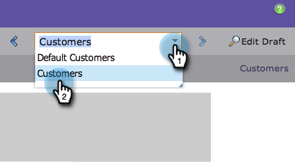

# Pré-visualizar uma página de destino com conteúdo dinâmico {#preview-a-landing-page-with-dynamic-content}

Pré-visualize a página de aterrissagem depois de adicionar conteúdo dinâmico para garantir que tudo esteja com a aparência desejada.

>[!PREREQUISITES]
>
>* [Usar Conteúdo Dinâmico em uma Página de Aterrissagem](/help/marketo/product-docs/demand-generation/landing-pages/personalizing-landing-pages/use-dynamic-content-in-a-landing-page.md)
>* [Visualizar uma Página de Aterrissagem](/help/marketo/product-docs/demand-generation/landing-pages/landing-page-actions/preview-a-landing-page.md)

1. Selecione uma página de aterrissagem e clique em **[!UICONTROL Visualizar página]**.

   

1. Clique na lista suspensa e selecione um **Segmento** para visualizá-lo.

   

Agora é possível garantir que as páginas de aterrissagem funcionem da maneira que você deseja que elas funcionem nos segmentos.
